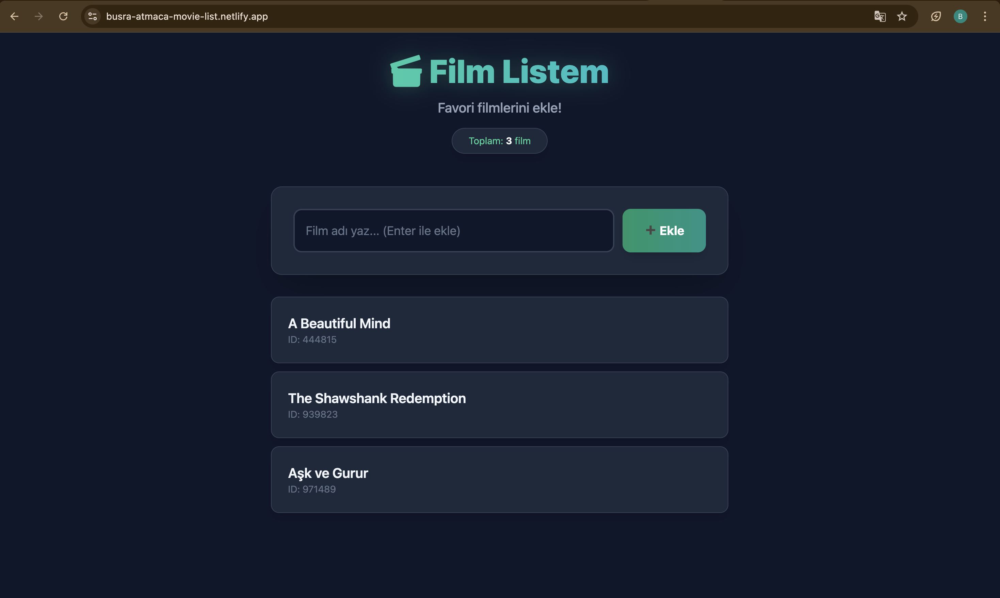

# 🎬 Film Listem (React CRUD Uygulaması)


React ve Tailwind CSS kullanılarak geliştirilmiş, LocalStorage destekli modern bir film listeleme uygulaması.

## 🚀 Özellikler

* ✅ **Film Ekleme:** Yeni filmleri listeye ekleyebilirsiniz.
* ✅ **Listeleme:** Eklenen tüm filmleri dinamik olarak görebilirsiniz.
* ✅ **Güncelleme:** Mevcut film isimlerini düzenleyebilirsiniz.
* ✅ **Silme:** Listeden istediğiniz filmi kaldırabilirsiniz.
* ✅ **Veri Kalıcılığı:** LocalStorage sayesinde sayfa yenilense bile verileriniz kaybolmaz.
* ✅ **Responsive Tasarım:** Tailwind CSS ile mobil ve masaüstü uyumlu arayüz.

## 🛠️ Kullanılan Teknolojiler

* **Framework:** ReactJS (Vite)
* **Styling:** Tailwind CSS
* **State Management:** React Hooks (useState, useEffect)
* **Storage:** Browser LocalStorage
* **Deployment:** Netlify

## 📁 Proje Yapısı

```text
src/
├── Components/    # Tekrar kullanılabilir arayüz elemanları
├── Pages/         # Ana sayfa ve ekran yapıları
├── Interfaces/    # Veri tipleri ve şablonlar
├── App.jsx        # Ana uygulama bileşeni
└── main.jsx       # Uygulama giriş noktası
